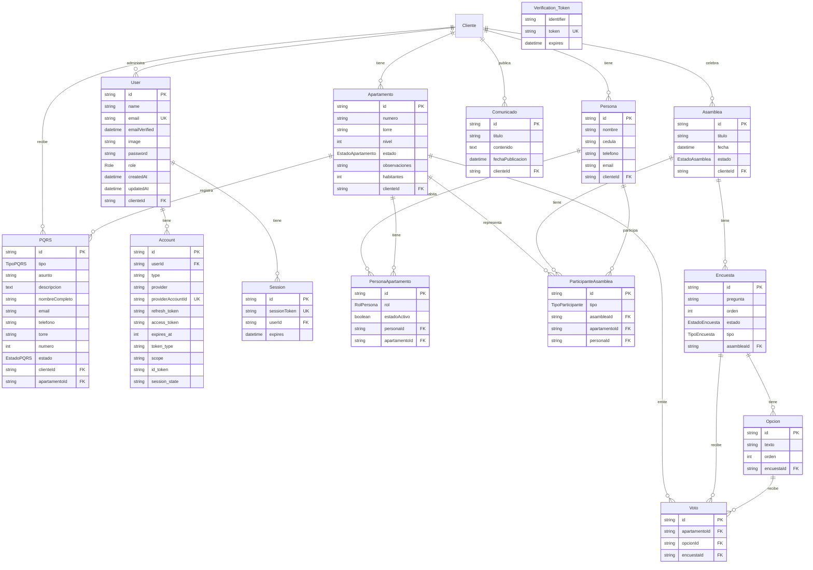

> **Nota**: La base de datos es PostgreSQL en Supabase. Las tablas incluyen soft deletes (`deletedAt`) para compatibilidad con el backend de Supabase.

### Entity-relationship diagram

```mermaid
erDiagram
    Cliente ||--o{ Apartamento : tiene
    Cliente ||--o{ Persona : tiene
    Cliente ||--o{ Asamblea : celebra
    Cliente ||--o{ Comunicado : publica
    Cliente ||--o{ PQRS : recibe
    Cliente ||--o{ User : administra

    User ||--o{ Account : tiene
    User ||--o{ Session : tiene

    Persona ||--o{ PersonaApartamento : habita
    Apartamento ||--o{ PersonaApartamento : tiene
    Apartamento ||--o{ ParticipanteAsamblea : representa
    Apartamento ||--o{ Voto : emite
    Apartamento ||--o{ PQRS : registra

    Asamblea ||--o{ Encuesta : tiene
    Asamblea ||--o{ ParticipanteAsamblea : tiene
    Persona ||--o{ ParticipanteAsamblea : participa

    Encuesta ||--o{ Opcion : tiene
    Encuesta ||--o{ Voto : recibe
    Opcion ||--o{ Voto : recibe

    Apartamento {
        string id PK
        string numero
        string torre
        int nivel
        EstadoApartamento estado
        string observaciones
        int habitantes
        string clienteId FK
    }

    Persona {
        string id PK
        string nombre
        string cedula
        string telefono
        string email
        string clienteId FK
    }

    PersonaApartamento {
        string id PK
        RolPersona rol
        boolean estadoActivo
        string personaId FK
        string apartamentoId FK
    }

    Asamblea {
        string id PK
        string titulo
        datetime fecha
        EstadoAsamblea estado
        string clienteId FK
    }

    ParticipanteAsamblea {
        string id PK
        TipoParticipante tipo
        string asambleaId FK
        string apartamentoId FK
        string personaId FK
    }

    Encuesta {
        string id PK
        string pregunta
        int orden
        EstadoEncuesta estado
        TipoEncuesta tipo
        string asambleaId FK
    }

    Opcion {
        string id PK
        string texto
        int orden
        string encuestaId FK
    }

    Voto {
        string id PK
        string apartamentoId FK
        string opcionId FK
        string encuestaId FK
    }

    Comunicado {
        string id PK
        string titulo
        text contenido
        datetime fechaPublicacion
        string clienteId FK
    }

    PQRS {
        string id PK
        TipoPQRS tipo
        string asunto
        text descripcion
        string nombreCompleto
        string email
        string telefono
        string torre
        int numero
        EstadoPQRS estado
        string clienteId FK
        string apartamentoId FK
    }

    User {
        string id PK
        string name
        string email UK
        datetime emailVerified
        string image
        string password
        Role role
        datetime createdAt
        datetime updatedAt
        string clienteId FK
    }

    Account {
        string id PK
        string userId FK
        string type
        string provider
        string providerAccountId UK
        string refresh_token
        string access_token
        int expires_at
        string token_type
        string scope
        string id_token
        string session_state
    }

    Session {
        string id PK
        string sessionToken UK
        string userId FK
        datetime expires
    }

    Verification_Token {
        string identifier
        string token UK
        datetime expires
    }
```