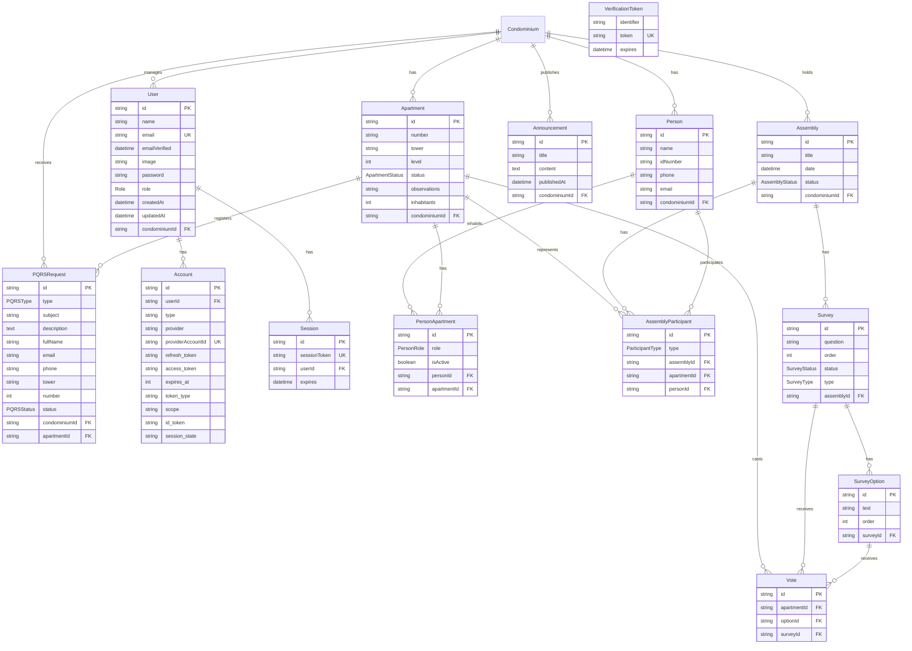

> **Note**: The database is PostgreSQL in Supabase. Tables include soft deletes (`deletedAt`) for compatibility with the Supabase backend.

### Entity-Relationship Diagram

```mermaid
erDiagram
    Condominium ||--o{ Apartment : has
    Condominium ||--o{ Person : has
    Condominium ||--o{ Assembly : holds
    Condominium ||--o{ Announcement : publishes
    Condominium ||--o{ PQRSRequest : receives
    Condominium ||--o{ User : manages

    User ||--o{ Account : has
    User ||--o{ Session : has

    Person ||--o{ PersonApartment : inhabits
    Apartment ||--o{ PersonApartment : has
    Apartment ||--o{ AssemblyParticipant : represents
    Apartment ||--o{ Vote : casts
    Apartment ||--o{ PQRSRequest : registers

    Assembly ||--o{ Survey : has
    Assembly ||--o{ AssemblyParticipant : has
    Person ||--o{ AssemblyParticipant : participates

    Survey ||--o{ SurveyOption : has
    Survey ||--o{ Vote : receives
    SurveyOption ||--o{ Vote : receives

    Apartment {
        string id PK
        string number
        string tower
        int level
        ApartmentStatus status
        string observations
        int inhabitants
        string condominiumId FK
    }

    Person {
        string id PK
        string name
        string idNumber
        string phone
        string email
        string condominiumId FK
    }

    PersonApartment {
        string id PK
        PersonRole role
        boolean isActive
        string personId FK
        string apartmentId FK
    }

    Assembly {
        string id PK
        string title
        datetime date
        AssemblyStatus status
        string condominiumId FK
    }

    AssemblyParticipant {
        string id PK
        ParticipantType type
        string assemblyId FK
        string apartmentId FK
        string personId FK
    }

    Survey {
        string id PK
        string question
        int order
        SurveyStatus status
        SurveyType type
        string assemblyId FK
    }

    SurveyOption {
        string id PK
        string text
        int order
        string surveyId FK
    }

    Vote {
        string id PK
        string apartmentId FK
        string optionId FK
        string surveyId FK
    }

    Announcement {
        string id PK
        string title
        text content
        datetime publishedAt
        string condominiumId FK
    }

    PQRSRequest {
        string id PK
        PQRSType type
        string subject
        text description
        string fullName
        string email
        string phone
        string tower
        int number
        PQRSStatus status
        string condominiumId FK
        string apartmentId FK
    }

    User {
        string id PK
        string name
        string email UK
        datetime emailVerified
        string image
        string password
        Role role
        datetime createdAt
        datetime updatedAt
        string condominiumId FK
    }

    Account {
        string id PK
        string userId FK
        string type
        string provider
        string providerAccountId UK
        string refresh_token
        string access_token
        int expires_at
        string token_type
        string scope
        string id_token
        string session_state
    }

    Session {
        string id PK
        string sessionToken UK
        string userId FK
        datetime expires
    }

    VerificationToken {
        string identifier
        string token UK
        datetime expires
    }
```
